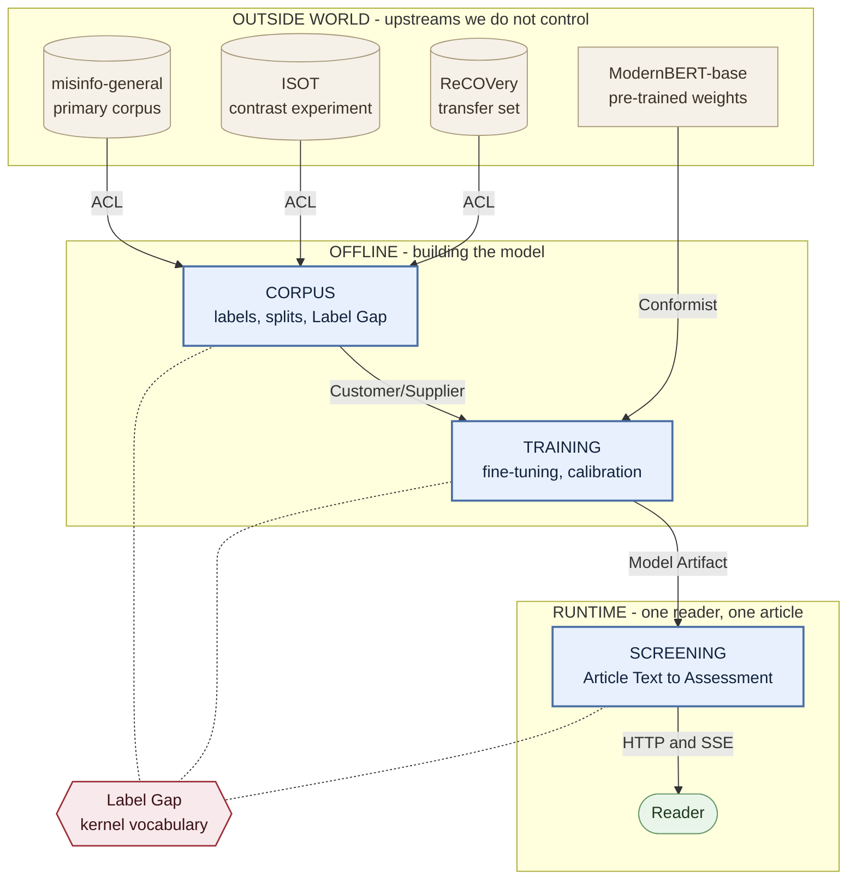

# Context Map

FactLens has three Bounded Contexts. This is the *strategic* map — where meaning changes, and
what has to be translated when it crosses a border. It says nothing about packages, tiers or
deployment; for the module layout see [#10](https://github.com/aoleszkiewicz/factlens/issues/10).

Framing is fixed by [ADR-0001](docs/adr/0001-credibility-assessment-not-truth-verdict.md),
architecture by [ADR-0002](docs/adr/0002-ports-and-adapters-without-tactical-ddd.md), and these
boundaries by [ADR-0003](docs/adr/0003-three-bounded-contexts-and-the-corpus-anticorruption-layer.md).

## Subdomains — the problem space

Subdomains are parts of the *problem*: they exist whether or not any software is written, they are
discovered rather than chosen, and `Core` / `Supporting` / `Generic` says how much thinking each one
deserves. Bounded Contexts are parts of the *solution*: boundaries chosen so that inside each one,
every term has exactly one meaning. The two do not have to line up, and here they do not.

| Subdomain | Kind | Why | Realised in |
|---|---|---|---|
| **Credibility Framing** — the Label Gap, and what a Credibility Score is permitted to claim | **Core** | The thesis contribution. Everyone fine-tunes a classifier; naming and measuring the gap between the label and the phenomenon is what makes this defensible under questioning. | slices of **Corpus** *and* **Screening** |
| **Corpus Curation** — Source-Disjoint Split, Register Leakage, the Contrast Experiment | Supporting | The techniques are known, but their application to this problem is specific and is a graded deliverable ([#8](https://github.com/aoleszkiewicz/factlens/issues/8)). It produces the evidence the Core subdomain rests on. | **Corpus** |
| **Model Production** — Fine-tuning, Calibration | Generic | A standard fine-tune of an upstream checkpoint and one scalar of temperature scaling. Nothing here is unique to FactLens; it must be done correctly, not cleverly. | **Training** |
| **Explanation** — Integrated Gradients → Token Attribution | Generic | An off-the-shelf attribution method. The decision to *show* attributions belongs to Screening Aid; the computation does not. | **Screening** |
| **Reader Delivery** — Fast Path, Attribution Job, Ephemeral Store, HTTP + SSE | Generic | Latency decomposition and streaming. Means the same thing here as in any system. | **Screening** |
| **Monitoring** — latency, duration, queue depth | Generic | No model to protect and no border to defend. Realised as instrumentation, not as a context — see [below](#what-is-deliberately-not-a-context). | **Screening** adapters |

Read the right-hand column: no context maps to exactly one subdomain, and the **Core** subdomain is
split across two of them. That is why `Label Gap` is kernel vocabulary rather than the property of
any single box.

Training realises a Generic subdomain. That is not a demotion — it is the reason the interesting
decisions are visibly *upstream* of the GPU, in the Split Manifest that Corpus authors and the Label
Gap that Corpus measures.

## Contexts — the solution space

| Context | Lifecycle | Owns |
|---|---|---|
| **Corpus** | Offline | Publisher, Unreliable Content *(Corpus sense)*, Label Semantics, Corpus Adapter, Source-Disjoint Split, Split Manifest, Register Leakage, Contrast Experiment |
| **Training** | Offline | Fine-tuning, Calibration, Evaluation Metrics, Source-Disjoint Gap; publishes the Model Artifact |
| **Screening** | Runtime | Article Text, Unreliable Content *(Screening sense)*, Credibility Score, Verdict Band, Assessment, Token Attribution, Fast Path, Attribution Job, Ephemeral Store |

Two groups of terms are owned by no context and are declared as such in
[`CONTEXT.md`](./CONTEXT.md): **Framing** (Disinformation, Screening Aid) and **Kernel**
(Label Gap). Three Corpus terms are additionally *supplied to* Training and are marked there —
Corpus owns them, Training consumes them.

**Unreliable Content is defined twice** — once in Corpus, once in Screening — and the two
definitions differ. In Corpus it is a property of the Publisher; in Screening it is a property of
the text. The distance between them is the Label Gap, and that difference is the reason this map has
more than one box.

## The map

**Legend — the kinds of border**

| On the map | Pattern | What it means |
|---|---|---|
| `ACL` | Anticorruption Layer | We translate their model into ours, so their vocabulary never leaks in. Each corpus must declare what its label encodes. |
| `Conformist` | Conformist | We adopt their model wholesale — tokeniser, context window, checkpoint format. Resisting an upstream we do not influence buys nothing. |
| `Customer/Supplier` | Customer/Supplier | Corpus is the upstream **Supplier**, Training the downstream **Customer**. Corpus owns the Split Manifest and the Label Semantics and is the only side that may change them; Training consumes them and asserts before an epoch runs. Training does not get a veto — it gets a *voice*: its needs are a real obligation on Corpus's plan, which is what separates this from Conformist. |
| `Model Artifact` | Published Language | One contract published once and consumed as-is: weights, tokeniser, temperature, band boundaries, measured Label Gap. |
| `HTTP and SSE` | Open Host Service | A protocol Screening publishes for anyone to speak to it. |
| dotted lines to `Label Gap` | Kernel vocabulary | One term all three contexts must mean identically. Dotted and undirected because nobody owns it and nobody may redefine it alone. |

## Relationships

**External corpora → Corpus — Anticorruption Layer.**
Each corpus enters through a **Corpus Adapter** that translates it into FactLens's own model. This
is not future-proofing: three corpora serve three different jobs *at once* — `misinfo-general` as
the primary, ISOT as the **Contrast Experiment**, ReCOVery as an external transfer set. An adapter
cannot yield articles without also declaring its **Label Semantics**, its **Label Gap** (measured
where measurable — 43.5% for `misinfo-general` — stated where not), and whether it can produce a
**Source-Disjoint Split** at all. ISOT structurally cannot, and that refusal is exactly what makes
it the Contrast Experiment rather than a corpus that was split badly.

A port yielding a bare `(text, label)` stream would make three incompatible label meanings
substitutable and bury the Label Gap inside the adapter — building the machine for hiding the one
thing [ADR-0001](docs/adr/0001-credibility-assessment-not-truth-verdict.md) promises to name.

**ModernBERT → Training — Conformist.**
Its tokeniser, 8192-token context window and checkpoint format are adopted wholesale. There is
nothing to gain from resisting an upstream we do not influence.

**Corpus → Training — Customer/Supplier.**
Corpus is upstream. It authors the **Split Manifest** (publisher→fold) and declares the **Label
Semantics**; Training consumes both and asserts against the manifest before an epoch runs. The
failure this exists to prevent is silent: one `train_test_split(df, random_state=42)` in Training
re-partitions at the article level, publishers reappear on both sides, and every evaluation number
quietly becomes an ISOT number. Nothing crashes and nothing warns.

This edge was first drawn as a **Shared Kernel**, and that was wrong. A Shared Kernel is a model
either side may change, so it imposes a standing two-way veto — the most expensive relationship in
DDD. Nothing in this design lets Training author a manifest or redefine Label Semantics; the
obligation runs one way, and Customer/Supplier is the pattern that says so. Training is not a
Conformist either: its needs are a budgeted obligation on Corpus, not something it works around.

The two contexts have **no conflicting terms** — every shared term means the same thing on both
sides, and every unshared term is simply absent on the other. So this border is not a boundary of
meaning; it is a lifecycle-and-deliverable boundary, kept deliberately and recorded as such in
[ADR-0003](docs/adr/0003-three-bounded-contexts-and-the-corpus-anticorruption-layer.md). The border
that *does* carry a meaning conflict is Corpus↔Screening, where **Unreliable Content** means two
different things.

> **Open:** the *masking rule* was listed here as a third shared concept. It is not defined in
> `CONTEXT.md` and it is probably not a Corpus/Training concern at all — if publisher-identifying
> spans are masked in training data, Screening must mask **Article Text** identically or the
> Credibility Score is computed over a distribution the model never saw. Resolve as either
> three-way kernel vocabulary alongside Label Gap, or delete the phrase.

**Label Gap — kernel vocabulary across all three.**
Corpus measures it, Training publishes it inside the Model Artifact, Screening states it to the
reader. It is drawn as its own node because it belongs to the **Core** subdomain while sitting
inside no single context: the term crosses every border on the map without being translated at any
of them. If a future change makes it mean three different things in three places, the Core subdomain
has silently dissolved and the thesis's central claim goes with it.

**Training → Screening — Published Language, translated by an Anticorruption Layer.**
The **Model Artifact** crosses the border as one unit: weights, tokeniser, Calibration temperature,
derived Verdict Band boundaries, and the measured Label Gap. The `Classifier` port is the ACL — the
seam where *P(unreliable-publisher class)* becomes a **Credibility Score**. This is where ADR-0001's
framing stops being prose and becomes executable, and the Label Gap is the measured cost of the
translation.

The seam is cheap; the swap is not. Changing the primary corpus invalidates the Model Artifact, the
temperature, the band boundaries and every number in the evaluation chapter. The map claims a cheap
boundary, never a cheap migration.

**Screening → Reader — Open Host Service.**
The published protocol is HTTP + SSE, in the sequence `accepted` → `score` → `progress` →
`attributions` → `done` (FR-8).

## What is deliberately not a context

Recording the omissions matters as much as the boxes — a reader who expects one of these should find
the reasoning here rather than assume it was forgotten.

- **The API / backend.** The Open Host Service of Screening, not a peer. A Bounded Context is a
  boundary of *meaning*; putting a tier on a map of languages is the most common way to draw one
  wrong. The UI is a client of that service.
- **The UI.** An adapter, per ADR-0002.
- **Evaluation.** MCC, F1-unreliable, the Source-Disjoint Gap and the reliability diagram are
  continuous with Training's vocabulary. Evaluation is an activity inside Training and a chapter of
  the thesis; a boundary there would separate nothing.
- **Monitoring.** A Generic Subdomain, listed in the subdomain table above. Latency, duration and
  queue depth mean the same thing here as in any system, so there is no model to protect and no
  border to defend. It is realised as instrumentation in Screening's adapter layer. The obligation
  does not vanish with the box: NFR-1, NFR-2, NFR-3 and NFR-6 are all marked testable, and a p95
  that was never recorded cannot be reported for thesis task 7.
- **A pipeline.** `Corpus → Training → Evaluation` is a dataflow. Its arrows say "happens after",
  never "translates into", which is why it is not this diagram.

## Repository layout

The contexts are **not yet separate directories**. `src/` is currently laid out by tier
(`data/`, `model/`, `api/`, `frontend/`), and the target package layout is
[#10](https://github.com/aoleszkiewicz/factlens/issues/10) — still open and blocked. Splitting
`CONTEXT.md` into per-context files now would mean guessing paths and moving them again.

Until #10 settles: one root [`CONTEXT.md`](./CONTEXT.md), with its term groups tagged by owning
context, and one `docs/adr/` for system-wide decisions.
