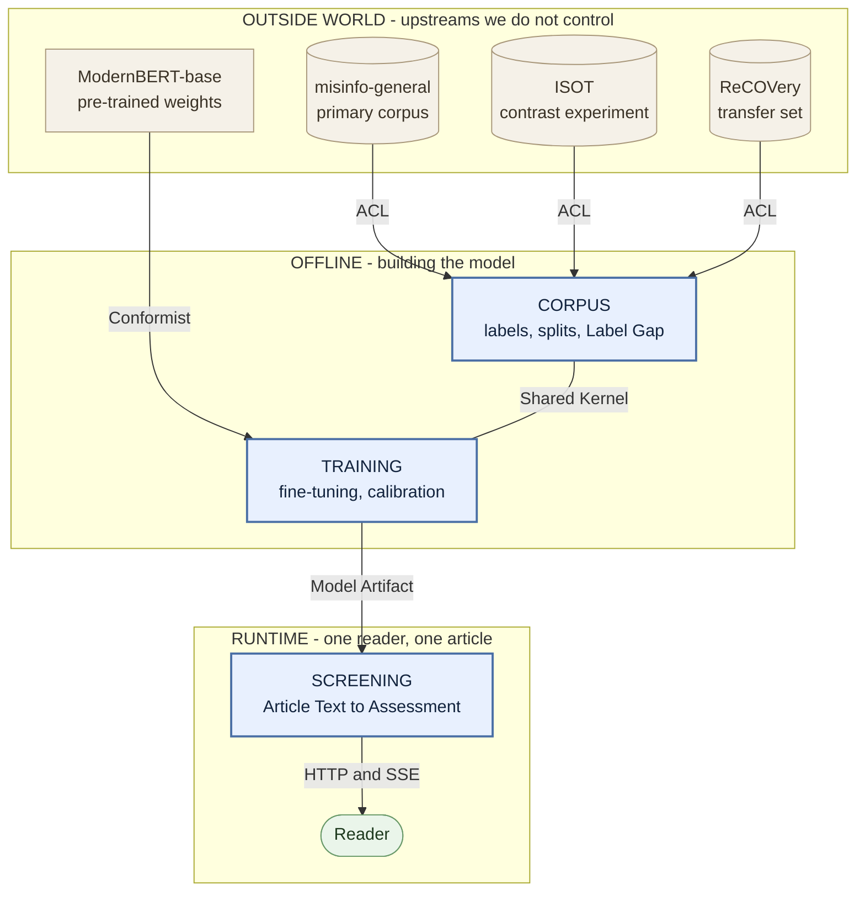

# Context Map

FactLens has three Bounded Contexts. This is the *strategic* map — where meaning changes, and
what has to be translated when it crosses a border. It says nothing about packages, tiers or
deployment; for the module layout see [#10](https://github.com/aoleszkiewicz/factlens/issues/10).

Framing is fixed by [ADR-0001](docs/adr/0001-credibility-assessment-not-truth-verdict.md),
architecture by [ADR-0002](docs/adr/0002-ports-and-adapters-without-tactical-ddd.md), and these
boundaries by [ADR-0003](docs/adr/0003-three-bounded-contexts-and-the-corpus-anticorruption-layer.md).

## Contexts

| Context | Kind | Lifecycle | Owns |
|---|---|---|---|
| **Corpus** | Core | Offline | Publisher, Label Semantics, Source-Disjoint Split, Split Manifest, Register Leakage, Label Gap, Contrast Experiment |
| **Training** | Core | Offline | Fine-tuning, Calibration, evaluation metrics, the Model Artifact |
| **Screening** | Core | Runtime | Article Text, Credibility Score, Verdict Band, Assessment, Token Attribution, Fast Path, Attribution Job, Ephemeral Store |

Vocabulary for all three lives in a single [`CONTEXT.md`](./CONTEXT.md), grouped by owning context —
see [Repository layout](#repository-layout) below.

## The map

**Legend — the five kinds of border**

| On the map | Pattern | What it means |
|---|---|---|
| `ACL` | Anticorruption Layer | We translate their model into ours, so their vocabulary never leaks in. Each corpus must declare what its label encodes. |
| `Conformist` | Conformist | We adopt their model wholesale — tokeniser, context window, checkpoint format. Resisting an upstream we do not influence buys nothing. |
| `Shared Kernel` | Shared Kernel | Drawn as a plain line, not an arrow, because the obligation runs **both ways**: split manifest, label semantics and masking rule must mean exactly the same thing on both sides, and a change on either breaks the other. |
| `Model Artifact` | Published Language | One contract published once and consumed as-is: weights, tokeniser, temperature, band boundaries, measured Label Gap. |
| `HTTP and SSE` | Open Host Service | A protocol Screening publishes for anyone to speak to it. |

## Relationships

**External corpora → Corpus — Anticorruption Layer.**
Each corpus enters through a **Corpus Adapter** that translates it into FactLens's own model. This
is not future-proofing: three corpora serve three different jobs *at once* — `misinfo-general` as
the primary, ISOT as the **Contrast Experiment**, ReCOVery as an external transfer set. An adapter
cannot yield articles without also declaring its **Label Semantics**, its **Label Gap** (measured
where measurable — 43.5% for `misinfo-general` — stated where not), and whether it can produce a
**Source-Disjoint Split** at all. ISOT structurally cannot, and that refusal is exactly what makes
it the Contrast Experiment rather than a corpus that was split badly.

A port yielding a bare `(text, label)` stream would make three incompatible label meanings
substitutable and bury the Label Gap inside the adapter — building the machine for hiding the one
thing [ADR-0001](docs/adr/0001-credibility-assessment-not-truth-verdict.md) promises to name.

**ModernBERT → Training — Conformist.**
Its tokeniser, 8192-token context window and checkpoint format are adopted wholesale. There is
nothing to gain from resisting an upstream we do not influence.

**Corpus ↔ Training — Shared Kernel.**
Three concepts must mean *exactly* the same thing on both sides: the **Split Manifest**
(publisher→fold), the **Label Semantics**, and the masking rule. The failure this exists to prevent
is silent: one `train_test_split(df, random_state=42)` in Training re-partitions at the article
level, publishers reappear on both sides, and every evaluation number quietly becomes an ISOT
number. Nothing crashes and nothing warns. Training asserts against the manifest before an epoch
runs.

Shared Kernel is the most expensive relationship in DDD — both sides must agree on every change.
With one developer that discipline is entirely self-imposed.

**Training → Screening — Published Language, translated by an Anticorruption Layer.**
The **Model Artifact** crosses the border as one unit: weights, tokeniser, Calibration temperature,
derived Verdict Band boundaries, and the measured Label Gap. The `Classifier` port is the ACL — the
seam where *P(unreliable-publisher class)* becomes a **Credibility Score**. This is where ADR-0001's
framing stops being prose and becomes executable, and the Label Gap is the measured cost of the
translation.

The seam is cheap; the swap is not. Changing the primary corpus invalidates the Model Artifact, the
temperature, the band boundaries and every number in the evaluation chapter. The map claims a cheap
boundary, never a cheap migration.

**Screening → Reader — Open Host Service.**
The published protocol is HTTP + SSE, in the sequence `accepted` → `score` → `progress` →
`attributions` → `done` (FR-8).

## What is deliberately not a context

Recording the omissions matters as much as the boxes — a reader who expects one of these should find
the reasoning here rather than assume it was forgotten.

- **The API / backend.** The Open Host Service of Screening, not a peer. A Bounded Context is a
  boundary of *meaning*; putting a tier on a map of languages is the most common way to draw one
  wrong. The UI is a client of that service.
- **The UI.** An adapter, per ADR-0002.
- **Evaluation.** MCC, F1-unreliable, the source-disjoint gap and the reliability diagram are
  continuous with Training's vocabulary. Evaluation is an activity inside Training and a chapter of
  the thesis; a boundary there would separate nothing.
- **Monitoring.** A Generic Subdomain. Latency, duration and queue depth mean the same thing here as
  in any system, so there is no model to protect and no border to defend. It is realised as
  instrumentation in Screening's adapter layer. The obligation does not vanish with the box:
  NFR-1, NFR-2, NFR-3 and NFR-6 are all marked testable, and a p95 that was never recorded cannot
  be reported for thesis task 7.
- **A pipeline.** `Corpus → Training → Evaluation` is a dataflow. Its arrows say "happens after",
  never "translates into", which is why it is not this diagram.

## Repository layout

The contexts are **not yet separate directories**. `src/` is currently laid out by tier
(`data/`, `model/`, `api/`, `frontend/`), and the target package layout is
[#10](https://github.com/aoleszkiewicz/factlens/issues/10) — still open and blocked. Splitting
`CONTEXT.md` into per-context files now would mean guessing paths and moving them again.

Until #10 settles: one root [`CONTEXT.md`](./CONTEXT.md), with its term groups tagged by owning
context, and one `docs/adr/` for system-wide decisions.
