<!-- _class: lead -->
# Klasyfikacja fake-news

**Aleksander Oleszkiewicz**
Sztuczne Sieci Neuronowe, projekt

---

## Problem

- **Zadanie:** klasyfikacja binarna artykułów prasowych (Real vs Fake).
- **Konwencja:** `1 = Real`, `0 = Fake`.
- Zbiór *Fake and Real News* (Kaggle), ~45 tys. artykułów po angielsku.

---

## Zbiór danych, pierwsze spojrzenie

- **44 898** artykułów, klasy niemal zrównoważone (~52% Fake, 48% Real).
- **~14% duplikatów**, niemal wyłącznie w klasie Fake (~26% tej klasy).
- ~1,4% tekstów pustych (same odnośniki YouTube).
- Rozkład długości prawoskośny, mediana ~370 słów dla obu klas.

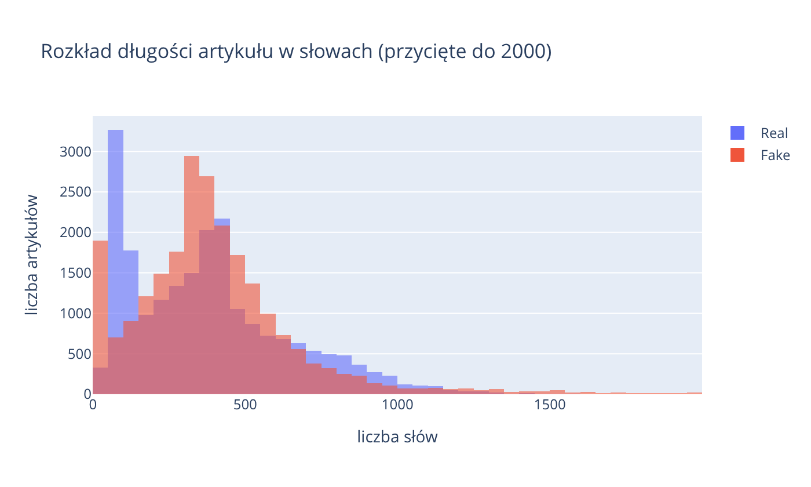

---

## Pułapka 1: kolumna `subject` to etykieta

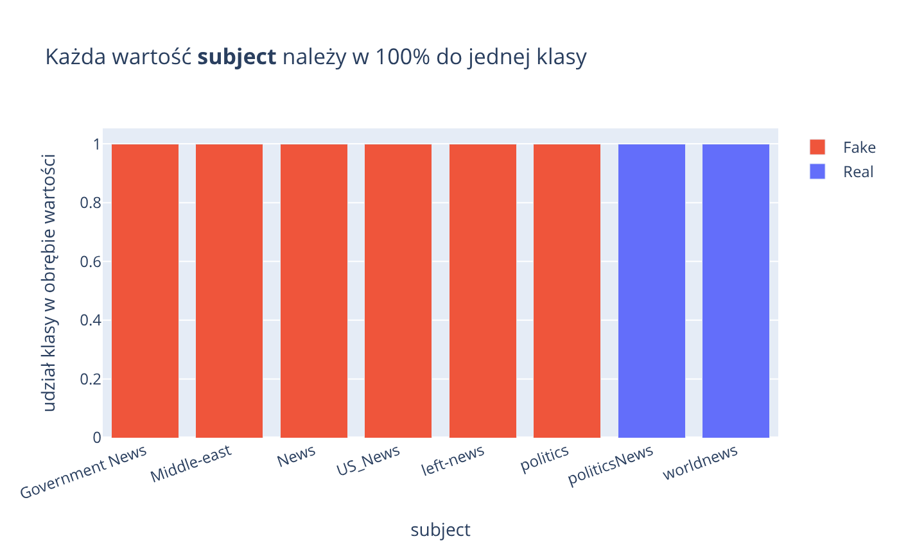

Każda wartość `subject` należy **w 100%** do jednej klasy (`politicsNews`, `worldnews` → Real; reszta → Fake). To nie cecha, to **target pod inną nazwą**, więc kolumnę odrzucamy.

---

## Pułapka 2: wyciek w treści `text`

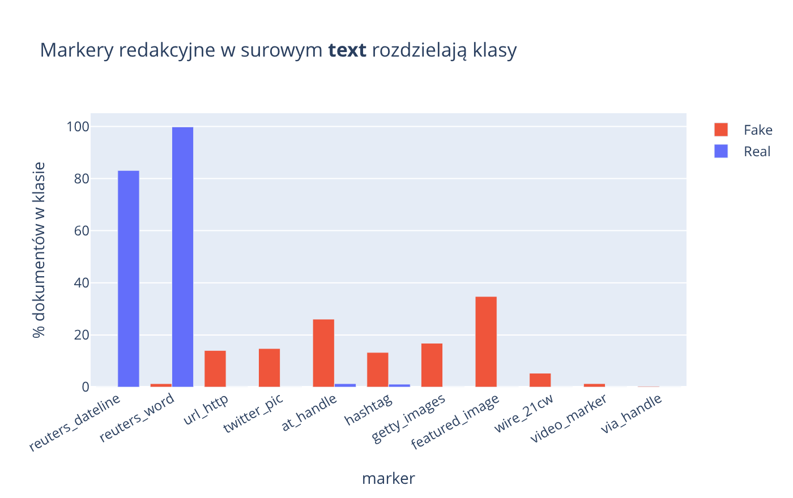

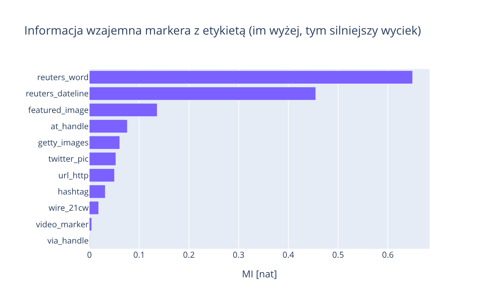

Markery redakcyjne (stempel Reuters, `getty images`, `@handle`, URL-e) rozdzielają klasy bez czytania treści. Informacja wzajemna stempla Reuters to ~0,65 nat, podczas gdy sensowne markery językowe rzadko przekraczają 0,05. Te artefakty **usuwamy w czyszczeniu**.

---

## Pułapka 3: styl `title` i format `date`

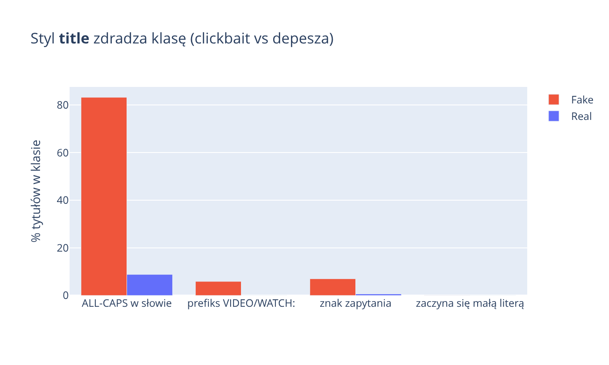

- `title`: tytuły Fake to clickbait (ALL-CAPS, `VIDEO:`, znaki zapytania), Real to spójny Title Case. Model uczyłby się **stylu nagłówka**, nie treści.
- `date`: wszystkie daty Fake mają niestandardowy format → trywialny wyciek.

**Dlatego model używa wyłącznie kolumny `text`.**

---

## Czyszczenie i podział danych

Kaskada wyrażeń regularnych (`src/data/cleaning.py`) usuwa m.in.:
markery Reuters, URL-e, `@handle`, prefiksy clickbait, podpisy zdjęć (getty),
HTML, sygnatury serwisów. Następnie normalizacja i małe litery.

**Filtr:** `min_words = 10`

**Efekt:**
44 898 → **38 470** artykułów

- duplikaty: 13,9% → **0%**
- kluczowe markery: → **0%**
- pokrycie GloVe: OOV ≤ 0,2%

Podział **stratyfikowany** 60/20/20: train 23 082, val 7 694, test 7 694.

---

## Reprezentacja: TF-IDF

- MLP przyjmuje wejście o **stałym rozmiarze**, a artykuły mają różną długość. TF-IDF koduje każdy dokument jako wektor o ustalonym wymiarze (słownik 50 000 termów).
- Waga termu to **TF** (częstość w dokumencie) razy **IDF** (rzadkość w całym korpusie): słowa pospolite (`the`, `said`) są tłumione, a rzadkie i różnicujące wzmacniane. Wektor niesie więc sygnał dyskryminacyjny, nie surowe zliczenia.
- `sublinear_tf` = log(TF) ogranicza wpływ wielokrotnych powtórzeń; bigramy (1-2-gramy) łapią proste frazy (`white house`).
- Reprezentacja jest **rzadka i wysokowymiarowa**, więc pierwsza warstwa `Linear` uczy się ważenia cech. Kolejność i kontekst słów są pomijane (model worka słów).
- Ten sam wektoryzator co baseline daje uczciwe porównanie LogReg vs MLP.

Parametry: `ngram_range=(1,2)`, `max_features=50 000`, `min_df=5`, `sublinear_tf`; dopasowanie **tylko na train**.

---

## Architektura: pipeline modelu

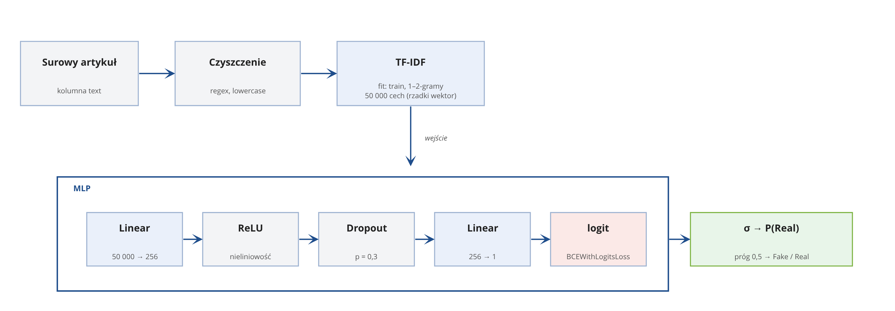

Pełna ścieżka inferencji: od surowego artykułu, przez czyszczenie i wektoryzację TF-IDF, do sieci MLP i prawdopodobieństwa klasy.

---

## Architektura MLP: hiperparametry

| Hiperparametr | Wartość |
|---|---|
| Funkcja straty | `BCEWithLogitsLoss` (logit na wyjściu) |
| Optymalizator | Adam, lr = 1e-3 |
| Rozmiar batcha / maks. epoki | 256 / 20 |
| Early stopping | po F1 walidacji, `patience = 3`, przywrócenie najlepszych wag |
| Regularyzacja | Dropout `p = 0,3` |
| Liczba parametrów | **12 800 513** |

---

## Trening: krzywe uczenia

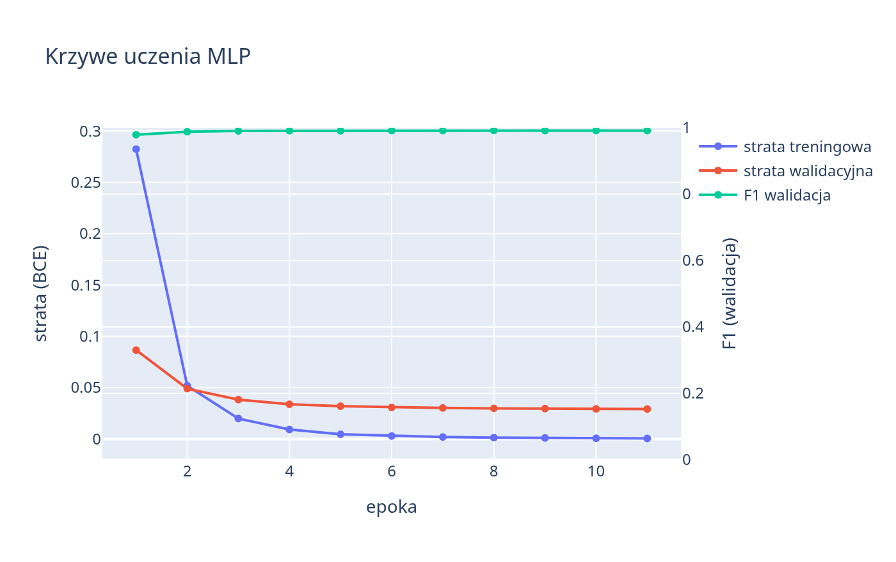

Sieć zbiega w pierwszych epokach; early stopping zatrzymał trening po **11 epokach**.

---

## Wyniki na teście

| Metryka | Walidacja | Test |
|---|---|---|
| accuracy | 0,9908 | 0,9864 |
| precision | 0,9899 | 0,9838 |
| recall | 0,9934 | 0,9915 |
| **F1** | 0,9916 | **0,9877** |
| **ROC-AUC** | 0,9992 | **0,9987** |

AUC 0,9987: model niemal idealnie rankinguje klasy.

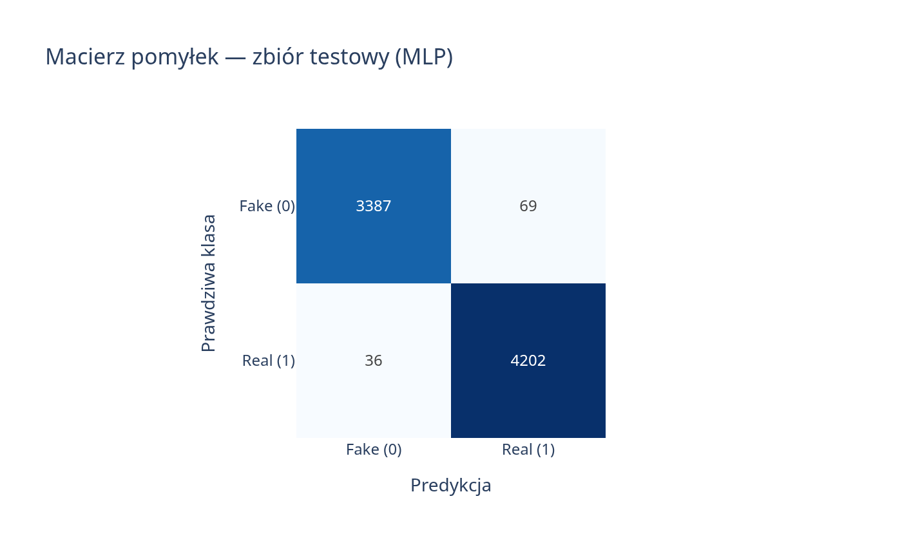
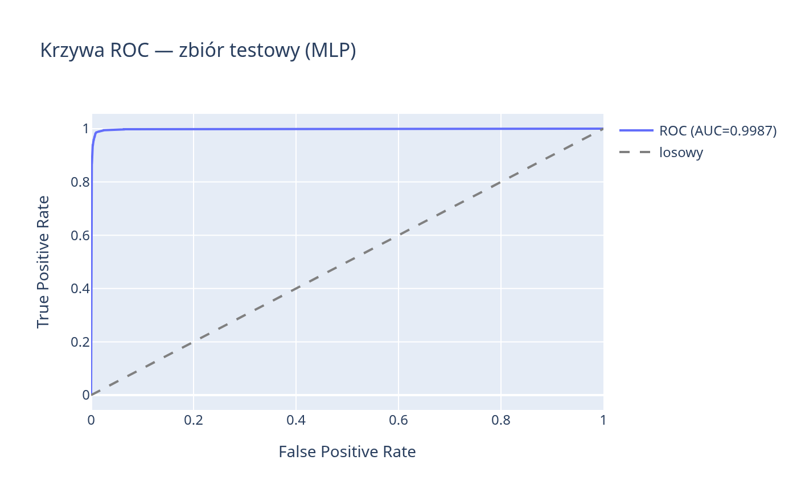

---

## Baseline vs MLP

| Metryka | LogReg | **MLP** |
|---|---|---|
| accuracy | 0,9795 | **0,9864** |
| F1 | 0,9815 | **0,9877** |
| ROC-AUC | 0,9970 | **0,9987** |

- F1: 0,9815 → 0,9877, czyli różnica ~0,006 (ok. **0,6 punktu procentowego**), marginalna.
- Klasy są niemal liniowo separowalne w przestrzeni TF-IDF, więc nieliniowość MLP nie daje istotnej przewagi nad modelem liniowym.

---

## Diagnoza bias-variance

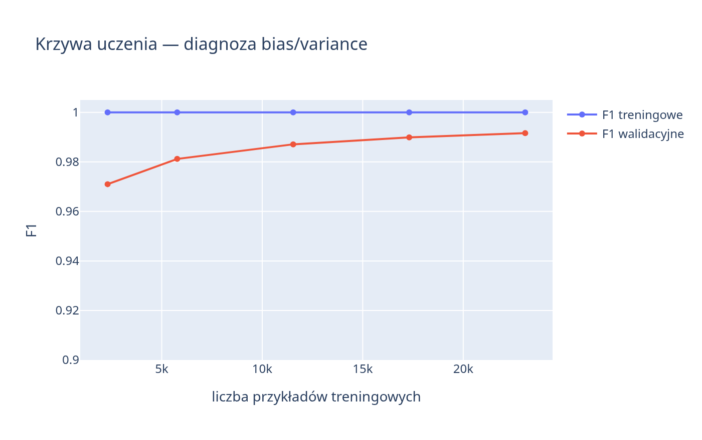

- F1 treningowe ≈ 1,0: **brak niedouczenia** (low bias).
- luka train-val ~1 pp i maleje ze wzrostem zbioru: **brak istotnego przeuczenia** (low variance).
- krzywa walidacji szybko wchodzi na plateau.

**Wniosek:** na tym zbiorze model nie wykazuje ani niedouczenia, ani przeuczenia.

---

## Interpretowalność cech

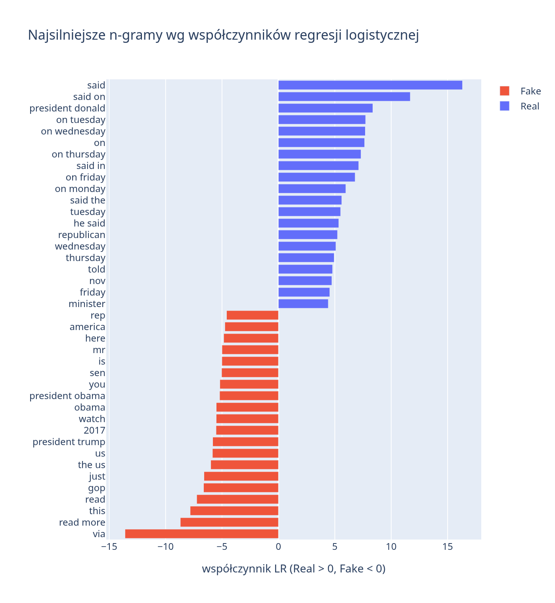

Real: `said`, `on wednesday`, `president donald`. Fake: `via`, `read more`, `watch`, `video`. **Żaden** usunięty marker wycieku nie wraca: model uczy się stylu, nie stempla.

---

## Wnioski

- Model **TF-IDF → MLP** osiąga F1 i ROC-AUC ~0,99 na zbiorze testowym.
- Na tym zbiorze sieć dorównuje modelowi liniowemu: reżim low bias / low variance, metryki przy suficie zbioru (klasy niemal liniowo separowalne w przestrzeni TF-IDF).
- Kluczowy wniosek: o wyniku decyduje **rzetelne przygotowanie danych** (eliminacja wycieku), a nie złożoność modelu; po usunięciu artefaktów model uczy się stylu, nie stempli.

---

<!-- _class: lead -->
# Dziękuję za uwagę

**Aleksander Oleszkiewicz**
